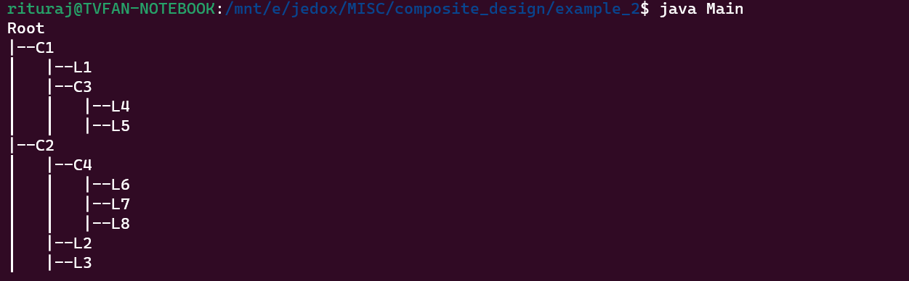

## example_2 uses Composite Design Pattern

- It uses [`Component.java`](./Component.java) as it an interface which provides the requirement specifications
- The [`Leaf.java`](./Leaf.java) and [`Composite.java`](./Composite.java) implement [`Component.java`](./Component.java)
- Both [`Leaf.java`](./Leaf.java) and [`Composite.java`](./Composite.java) overide the same method `printTree`
- Hence when calling using `printTree` gives a feel viz similar to recursion

### Output

