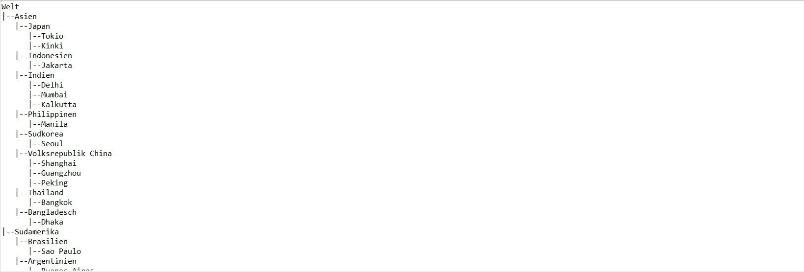

# Datasource to Tree

The goal of this homework is to read an excel datasource and convert it to **Tree** datastructure.
The source code is written in Java 

## About the Project
`Tree` is the project folder used which contains all the required files and dependencies as a maven project.
- Eclipse was used to build the project


- [`pom.xml`](./Tree/pom.xml) contains all the dependencies for the maven project
- [`data`](./Tree/data) folder contains our Excel file `Book1.xlsx` used as datasource
- [`Main.java`](./Tree/src/main/java/utils/Main.java) the Entry point to our project
- [`Parser.java`](./Tree/src/main/java/utils/Parser.java) contains a parser to parse  `Book1.xlsx` 
- `Parser.java` also contains a `parse` method to get Tree as output
- [`Tree.java`](./Tree/src/main/java/utils/Tree.java) contains implementation of Tree class with corresponding methods

### About Parser.java

- Contains a variable `rows` which denotes how many rows of `Book1.xlsx` you want to scan
- After every node insertion you need to give integer as input. This was done to hold the check the output on console

- Important Code Snippet which inserts a new node in the Tree.

```bash
        for(int i=1; i < rows ; i++) { 
        	Tree pointer=root;
        	for(int j=cols-1; j >= 0 ; j--) {
        		Tree child= new Tree(array[i][j]);
        		Tree child_present=pointer.search(child);
        		if (child_present==null)
        			pointer.getChildren().add(child);
        		
        		//update the pointer
        		pointer=pointer.search(child);
        		
        		System.out.println(root);
                keyboard.nextInt();
            }

        	System.out.println("_____________________________________________");
        }

```

### Output

